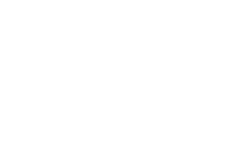
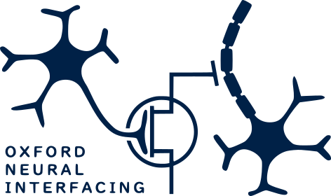

TriggerMate
================

<!-- WARNING: THIS FILE WAS AUTOGENERATED! DO NOT EDIT! -->

The TriggerMate provides a simple way to generate stimulation pulse
trains with custom parameters.

The device is connected to a stimulation system using the trigger port.
The stimulation parameters can then be set using the device controls.
Pulses will then be generated to trigger the stimulator according to the
desired parameters. This provides great flexibility in controlling
stimulation.

## Set up

The device needs to be powered via its microUSB connector. The trigger
output BNC port should then be connected to the target stimulator’s
trigger port. Stimulation settings can then be set using the device
interface.

A synchronisation output is provided via a second BNC port. This allows
the device to provide an input to trigger, for example, commonly used
EMG systems where stimulation is used in combination with
electrophysiological recording.

Further detail is provided in the [`setup`](./setup.html) section.

## Triggering

Once connected to the stimulation system, the device will start to
generate trigger pulses according to the parameters set on the device
interface. Note that the device generates only triggers to determine the
timing and frequency of stimulation; the parameters of individual pulses
should be set on the target stimulator.

The device provides three modes of stimulation with different
behaviours: `normal` mode for tonic stimulation at low frequencies;
`high frequency` mode for tonic stimulation at multiple kilohertz; and
`burst` mode for stimulation using bursts of high-frequency pulses.

Further detail is provided in the [`triggering`](./triggering.html)
section.

## Example applications

The device provides a convenient means of testing the effects of
stimulation with varying parameters in any setting. The ability to
easily and rapidly alter stimulation settings provides great flexibility
in the stimulation applied.

Examples of `normal` stimulation at 40Hz, `high frequency` stimulation
at 1kHz and `burst` stimulation with a burst frequency of 40Hz, and
intra-burst frequency of 1kHz and 5 pulses per burst are shown below.

Further synchronisation outputs allow the device to be easily provide
trigger inputs to standard EMG systems, facilitating the investigation
of the electrophysiological effects of stimulation with varying
parameters.

